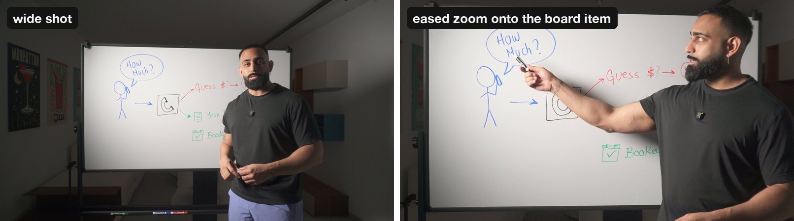
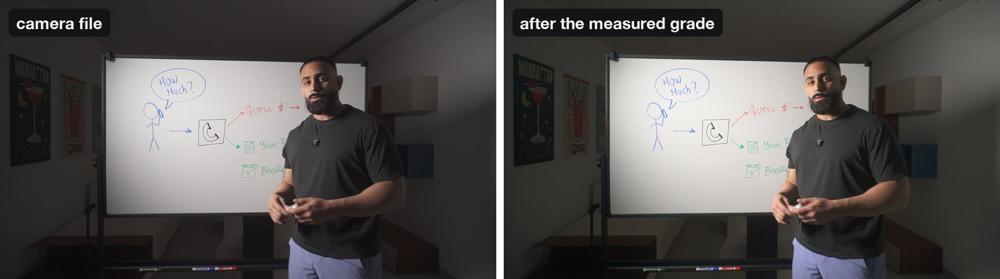
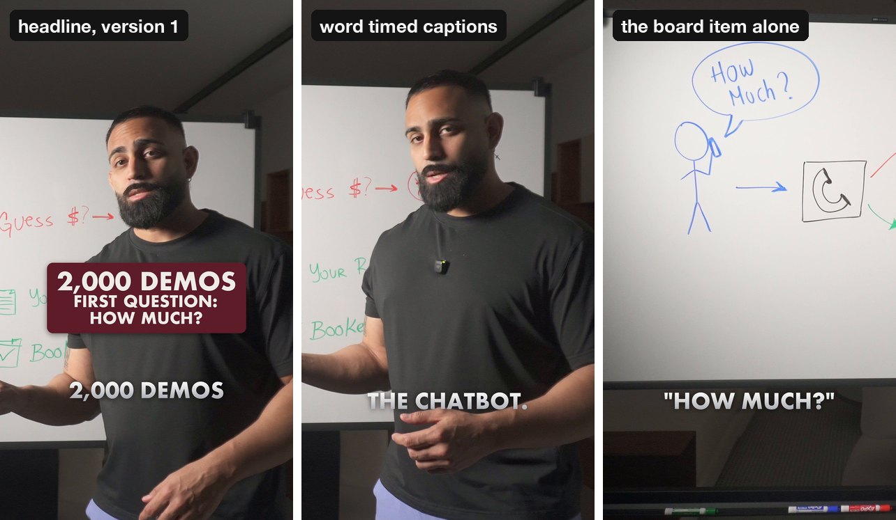

# Whiteboard video editor for Claude Code

A Claude Code skill that edits a filmed whiteboard talk for you. You film one take in 4K: you, a whiteboard, a camera on a tripod. You hand Claude the file. It gives back:

1. **The long form video** (1080p): the ums, the dead air and the retakes cut out, the camera easing in on each board item as you name it, a clean color grade, and audio mastered to -14 LUFS.
2. **A vertical reel** (1080x1920) cut from the same take, in **3 versions that differ only in the opening headline**, with word timed captions.
3. **3 reel covers**, one per headline.

Every step has a gate that measures the result (cut boundaries, faces at the frame edge, color, loudness, caption read back, platform safe zones). A file that fails a gate is not handed over.

## What it does

**Eased zooms onto the board.** You tell nothing to the camera. Claude reads the transcript, finds where you name or write each board item, and plans a smooth move onto it. The moves are rendered from the 4K file at sub pixel precision, so they do not shimmer or step.



**A color grade that is measured, not tuned.** The script samples the take: the white of the board, the shadows, the skin tone, the light on the face. It builds one grade from those numbers, so the board is a clean white and the skin stays natural. It is subtle on purpose. Five color gates then check the encoded file.



**A reel with a headline and word timed captions.** The headline and the captions are placed where they never cover your face or the board item on screen, on every frame, inside the area the apps do not cover. You get three headline versions to test against each other.



The stills above are frames from a real take edited with this skill.

## Requirements

- **macOS.** The pose tracking, the caption read back and the cover expression check use Apple Vision.
- **Claude Code.**
- **Footage:** 3840x2160 at 23.976 fps, one presenter, a camera that does not move.
- **Tools:** `ffmpeg` (version 8 was used), `node` 18 or newer, `python3` with Pillow, the Xcode command line tools.
- **An ElevenLabs API key** with Speech to Text access. The transcripts come from ElevenLabs Scribe.
- Optional: `whisper-cli` (whisper.cpp) to settle a disputed caption word.

It was built and tested with ffmpeg 8.0, Node 22 and Python 3.12 on macOS 26 on an Apple Silicon Mac. Other versions are untested.

## Install

```bash
# 1. the tools (skip what you have)
brew install ffmpeg node
python3 -m pip install pillow
xcode-select --install

# 2. the skill
git clone https://github.com/zalogarcia/claude-whiteboard-video-editor.git
mkdir -p ~/.claude/skills
cp -R claude-whiteboard-video-editor/skill ~/.claude/skills/whiteboard-video-edit

# 3. your key, where Claude Code's shell can read it
echo 'export ELEVENLABS_API_KEY=your_key_here' >> ~/.zshenv

# 4. one time setup: checks the tools and compiles the three Apple Vision helpers
~/.claude/skills/whiteboard-video-edit/scripts/setup.sh
```

Setup must end with `READY`. Start a new Claude Code session after step 3 so it sees the key.

## Use

Open Claude Code and ask in plain words. For example:

- "Edit my whiteboard video: ~/Movies/talk1.MP4. Put the work in ~/Movies/talk1-edit."
- "Cut a 30 second reel from it about the pricing question, with 3 headlines."
- "The second headline is weak. Give me 3 new ones and render the reel again."
- "Make the reel covers."

Claude asks you where the work folder goes if you do not say. It shows you the cut list, the zoom plan and the headlines as it goes, so you can change them before the long renders.

## Change the look

`skill/look.json` holds the headline panel color, the text colors, the font and the sizes. Those are defaults. Change a value there and every reel and cover uses it.

The default font is Futura Bold, which ships with macOS. If your Mac does not have it, the skill uses the first of Avenir Next Bold, Helvetica Neue Bold or Arial Bold that it finds. You can add your own font to the list in `look.json`.

## What it costs to run

These are rough numbers.

- **Claude:** this is most of the cost. One video is a long session: Claude reads the transcript, measures the board, plans the zooms, runs the renders and checks every gate. Expect a few hours of Claude Code work per video and a real share of a subscription's daily usage. Token use for a full video was not measured.
- **ElevenLabs Scribe:** billed by the hour of audio. A video needs about 3 passes (the take, the finished master as a check, the reel), so a 10 minute take is about 20 minutes of audio. That is cents, not dollars. Check the current price on the ElevenLabs site.
- **Your Mac:** on an Apple Silicon Mac the renderer does about 15 frames per second across 8 processes, so a 10 minute video renders in about 16 minutes. The reel and the covers add a few minutes.
- **Disk:** plan for 5 to 10 GB of work files per video on top of the footage. Most of it can be deleted after delivery.

## Check that it works on your Mac

The skill ships a proof run that takes a short slice of one of your takes through the whole rail: `scripts/selftest.sh`. It needs a board rectangle file, a focus file, a clips file and three headlines for that slice. Ask Claude: "Run the whiteboard skill's selftest on 20 seconds of this take." It ends with `green so far: 9 of 9 stages` when everything works.

## Limits

- macOS only.
- 4K at 23.976 fps only. Other sizes and frame rates need a convert step first.
- One presenter and a camera that does not move. No multi camera, no screen recordings.
- Tested in English only.
- The skin tone, face light and cover expression checks were tuned on one presenter. On another face they can fail on a frame that looks right. Claude is told to show you the numbers before it changes a threshold.
- Claude measures the board items by eye on a grid. It draws them back on the frame to check, but look at that picture yourself the first time.
- No music, no motion graphics, no thumbnails, no upload. It edits what you filmed.
- No sample footage is in this repo.

## What is in the repo

- `skill/SKILL.md`: the instructions Claude follows, step by step, with every gate.
- `skill/look.json`: the look defaults.
- `skill/scripts/`: the scripts. Python (Pillow only), Node with no packages, zsh, and three small Swift files that `setup.sh` compiles.

## License and credits

MIT, see [LICENSE](LICENSE). Made by Zalo Kabche.

The rough cut helpers (`transcribe.py`, `pack_transcripts.py`, `rough_cut.py`, `timeline_view.py`) are adapted from [browser-use/video-use](https://github.com/browser-use/video-use), also MIT. See [THIRD_PARTY_NOTICES.md](THIRD_PARTY_NOTICES.md).
